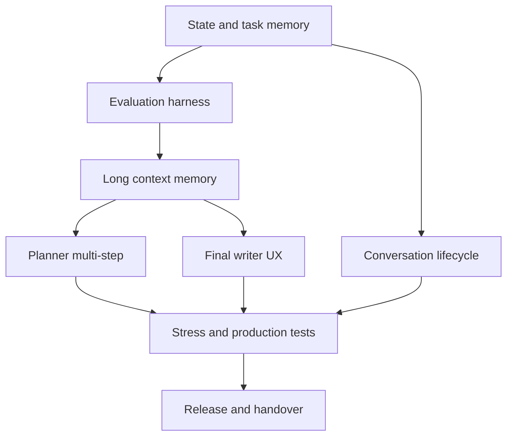

# Plan — ZenithTasks AI Deep Upgrade

| ID | Phase | Phụ thuộc | Đầu ra | Tiêu chí hoàn thành | Trạng thái |
|---|---|---|---|---|---|
| P1 | Khôi phục trạng thái và chuẩn hóa memory nhiệm vụ | — | brief, plan, state, decisions, sources | Có checkpoint và không chồng thay đổi chưa biết nguồn | complete |
| P2 | Evaluation harness và baseline | P1 | stress cases, test runner, baseline report | Có benchmark ngắn/dài/multi-turn/safety với số liệu | in_progress |
| P3 | Memory/context dài hạn | P2 | conversation summary, durable facts, retrieval/shaping | Giữ mục tiêu qua >=10 lượt, không kéo lỗi cũ vào phiên mới | complete |
| P4 | Planner nhiều bước/self-check | P3 | plan/execute/verify loop, bounded tool calls | Không mutation ngoài approval; action đọc nhiều bước có kiểm chứng | complete |
| P5 | Final writer và UX | P3,P4 | câu trả lời tự nhiên, progress, error recovery, feedback | Trả kết luận trước, rõ trạng thái, không lặp prompt | complete |
| P6 | Conversation lifecycle | P1 | xóa/archive từ danh sách, filter stale/error, safe confirmation | Xóa đúng conversation/message, tách approval, không đụng nghiệp vụ | complete |
| P7 | Stress/regression/production verification | P4,P5,P6 | test report, live read-only smoke tests | Không lỗi safety mức cao; >=90% evaluation điểm | in_progress |
| P8 | Release/rollback/handover | P7 | commit, PR/merge, deploy, rollback note, report | Production smoke pass và state complete hoặc open blockers rõ ràng | in_progress |

## Dependency map

## Test policy

Read-only tests may chạy trực tiếp trên production khi người dùng đã cho phép; write/destructive tests chỉ chạy bằng mock/test database hoặc dừng ở preview. Mọi kết quả phải lưu trong `.task-memory/checks/` hoặc `checks/`, kèm commit/source và trạng thái xác minh.
