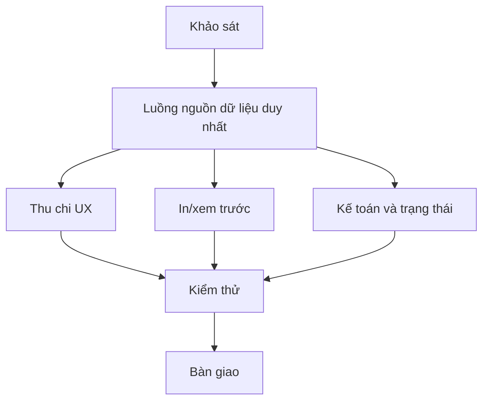

# Kế hoạch — Tích hợp Thu chi–Đề nghị thanh toán

| ID | Phase | Phụ thuộc | Đầu ra | Trạng thái |
|---|---|---|---|---|
| P1 | Khảo sát mẫu PDF, route, schema và quyền | — | Bản đồ hiện trạng + quy tắc nghiệp vụ | done |
| P2 | Thiết kế luồng nguồn dữ liệu duy nhất | P1 | Expense tạo CashTransaction + PaymentRequest trong một transaction; không tạo trùng khi thanh toán | done |
| P3 | Tự động điền và liên kết giao diện | P2 | Form Thu chi không còn checkbox nhập lại; bảng Thu chi mở đúng phiếu; menu riêng được ẩn | done |
| P4 | Xem trước, Word, in và Lưu PDF | P2 | Trang `[id]`, route `/print`, route `.doc`, CSS A4 theo mẫu, số tiền bằng chữ | done |
| P5 | Kết nối Kế toán và trạng thái | P2,P3 | Kế toán xem/duyệt/xác nhận; phiếu đã có dòng chi không tạo dòng mới; edit trước duyệt đồng bộ | done |
| P6 | Kiểm thử và rà soát | P3,P4,P5 | TypeScript, Next build, Vitest; kiểm tra output HTML | in_progress |
| P7 | Commit, push và bàn giao | P6 | Commit/branch/PR hoặc hướng dẫn deploy + changelog | not_started |

## Dependency map

## Criterial gates

| Gate | Điều kiện |
|---|---|
| G1 | Một khoản Chi tạo đúng một PaymentRequest và một CashTransaction liên kết. |
| G2 | Sửa khi PENDING đồng bộ cả hai; APPROVED/PAID vẫn bị khóa. |
| G3 | Xem trước/in có tiêu đề mẫu, kính gửi, họ tên, địa chỉ, lý do, số tiền bằng số/chữ và bốn vị trí ký. |
| G4 | Luồng ghi sổ PaymentRequest cũ không tạo trùng với request đã có CashTransaction. |
| G5 | TSC, test suite và Next production build pass. |
