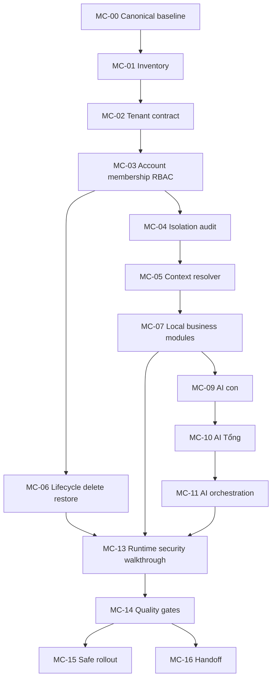

# Plan — Multi-company + AI phân cấp

> Đây là kế hoạch thực thi của chương trình mới, dùng để mở rộng kế hoạch Workspace V4 hiện có. Workbook canonical `ZENITH_PLAN_DUY_NHAT_2026.xlsx` chưa có trong sandbox nên các mã dưới đây là **crosswalk tạm thời**, không thay thế `E00–E09` canonical. Khi workbook được phục hồi, phải map lại mã và không tạo backlog song song.

## Goal

Đưa mô hình nhiều công ty con vào trạng thái có thể vận hành an toàn: tạo công ty, tài khoản và nhân viên riêng, dữ liệu không chéo, AI con theo tenant, AI Tổng theo hệ thống, vòng đời xóa/khôi phục an toàn và bằng chứng runtime.

## Task tree và dependency

| ID tạm thời | Phase | Công việc | Phụ thuộc | Acceptance/evidence bắt buộc | Risk | Status |
|---|---:|---|---|---|---|---|
| MC-00 | 1 | Khôi phục canonical workbook, state và source matrix; đối chiếu master | — | Workbook hoặc decision ghi rõ unavailable; baseline SHA; source-of-truth duy nhất | R0 | done |
| MC-01 | 1 | Inventory schema/action/UI hiện có cho `ZProject`, member, employee, AI scope | MC-00 | Matrix model → route → action → test → gap | R0 | done |
| MC-02 | 2 | Chốt tenant contract: company status, code, timezone, owner, settings, module flags | MC-01 | ADR + schema acceptance + forbidden transitions | R1 | done |
| MC-03 | 2 | Chốt account/membership contract: user, employee profile, project role, invite/revoke | MC-02 | RBAC matrix, active/revoked tests, no cross-project lookup | R3 | done |
| MC-04 | 3 | Audit và hoàn thiện projectId boundary cho mọi domain record/project action | MC-03 | Synthetic P1/P2 isolation test cho list/detail/aggregate/export | R3 | in_progress |
| MC-05 | 3 | Xây tenant context resolver dùng chung cho page/action/AI | MC-04 | Missing/stale/foreign project context fail closed; no legacy fallback | R3 | in_progress |
| MC-06 | 4 | Lifecycle company: create → draft → active → archived; soft-delete/restore | MC-03,MC-05 | Preview, approval, audit, dependency check, rollback/restore test | R3 | not_started |
| MC-07 | 5 | Hoàn thiện Customer/Appointment/Sales/Finance/Task local theo tenant | MC-04,MC-05 | CRUD/permission/aggregate tests và UI empty/loading/error states | R2/R3 | in_progress_partial |
| MC-08 | 5 | Payroll/mechanism local với payout/accounting contract rõ ràng | MC-07 | Calculation snapshot, two-person approval, no Internal mixing; owner decision | R3 | blocked_pending_owner |
| MC-09 | 5 | AI con cho từng company: profile, model/config, knowledge, tool allowlist, context | MC-05,MC-07 | AI child cannot read foreign/Internal; tool registry and audit tests | R3 | in_progress_partial |
| MC-10 | 6 | AI Tổng: global aggregate, company selector, child health/status/audit view | MC-03,MC-09 | ADMIN-only global scope; bounded aggregate; no hidden escalation | R3 | in_progress_partial |
| MC-11 | 6 | AI Tổng điều phối AI con bằng message/job contract, không truyền dữ liệu thừa | MC-09,MC-10 | Corrected explicit source/target scope, trace, bounded timeout/retry/idempotency and no prompt-only trust; persistent enqueue is code-level only | R3 | in_progress_partial |
| MC-12 | 7 | QA seed 2–3 company, Admin/Manager/employee roles, non-PII | MC-04,MC-09 | Reproducible seed + reset only isolated QA DB | R3 | in_progress_partial |
| MC-13 | 7 | Security/RBAC/isolation/runtime walkthrough | MC-06,MC-07,MC-10,MC-12 | Foreign URL, revoked membership, AI child/global, delete/restore all tested | R3 | not_started |
| MC-14 | 7 | Full quality gates and migration proof | MC-13 | Prisma generate/validate, tsc, Vitest, build, migrate status, backup proof | R3 | in_progress_partial |
| MC-15 | 8 | Clinic updater, rollout, post-deploy smoke and handoff | MC-14 | Owner backup/approval, updater exit 0, health, runtime evidence, docs | R3 | blocked_owner_gate |
| MC-16 | 8 | Canonical workbook/state/changelog and training handoff | MC-14,MC-15 | Source-of-truth docs updated; no open TODO without owner/next action | R0 | not_started |

## Dependency graph

## Current checkpoint

MC-02/MC-03 đã merge qua PR #56/#57; các wave MC-04–MC-12 đã merge tiếp theo. Master hiện ở `7c33cd5` sau PR #75/#76; CI push/pull_request pass cho hai PR này. QA độc lập `zenithqa` đã seed guarded, verifier read-only và authenticated GET-only walkthrough v8 pass sau khi rebuild image; evidence sanitized ở `checks/mc13-auth-runtime-20260828.md`. MC-04/MC-05 vẫn `PARTIAL` vì chưa có export/list-detail/aggregate đầy đủ; MC-13 `PARTIAL` vì chưa có export isolation và authenticated server-action write-denial evidence. MC-09/MC-10 vẫn `PARTIAL`: registry/policy/runtime read scope đã có, nhưng child mutation, health/heartbeat và Global message/job orchestration chưa có. MC-11.1 corrective contract và MC-11.2 additive persistence/enqueue hiện mới có code-level evidence, chưa QA migration/worker/dispatcher E2E. Không migration/deploy clinic.

## Quality gates

A task is `done` only when its acceptance, code/test/build evidence, artifact path, check path, reviewer/owner decision and next action are recorded. No R3 task is closed by compile/unit tests alone. No hard delete, payroll payout, permission escalation, migration or clinic deployment is automatic.

## Execution order for first implementation wave

1. MC-00/MC-01: restore canonical state and build the exact current-state matrix.
2. MC-02/MC-03: make the tenant/account/membership contract explicit before adding more modules.
3. MC-04/MC-05: close isolation at shared server boundary.
4. MC-06: implement safe company lifecycle and deletion preview, but keep hard delete unavailable.
5. MC-12: chạy guarded seed trên PostgreSQL QA cô lập và authenticated walkthrough; không dùng clinic DB.
6. Sau MC-12 evidence: hoàn thiện MC-07/MC-09/MC-10/MC-11 theo contract; full-gate rồi mới apply ZAiJob migration trên QA cô lập, sau đó mới MC-13→MC-16 với migration, backup và owner gate.
