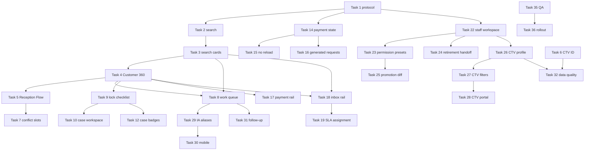

# Execution plan — 35 nhiệm vụ được duyệt

## Trạng thái quy ước

`not_started`, `in_progress`, `review`, `done`, `blocked`, `cancelled`. Task 11 là `cancelled` theo quyết định nghiệp vụ, không được mở lại trong execution này.

## Phase map

| Phase | Task | Phụ thuộc | Quality gate |
|---|---|---|---|
| P1 — nền tảng | 1 | — | task protocol/checklist đọc được |
| P2 — search/Customer 360 | 2, 3, 4 | 1 → 2 → 3 → 4 | permission/query/phone mask/typecheck/test |
| P3 — lễ tân/điều phối | 5, 6, 7, 8 | 2–4; 5→7; 3/4→8 | E2E intake, duplicate, conflict, queue dedup |
| P4 — hồ sơ | 9, 10, 12, 13 | 4; 9→10→12; 9→13 | lock checklist, role workspace, không tự áp BOM |
| P5 — tài chính | 14, 15, 16, 17 | 1; 14→15/16; 4/14→17 | state transition, amount integrity, no reload |
| P6 — CSKH | 18, 19, 20, 21 | 3/4; 18→19/20/21 | scope, SLA, draft privacy, thread state |
| P7 — Nhân sự/CTV | 22, 23, 24, 25, 26, 27, 28 | 1; 22→23/24/25/26; 26→27→28 | role lifecycle, CTV scope, rename/history |
| P8 — IA/automation/measure | 29, 30, 31, 32, 33, 34 | 2/8; 8/10; 6/26 | aliases, responsive, dedup, privacy telemetry |
| P9 — QA/release | 35, 36 | 1–34 except 11 | full matrix, CI, backup/migration/runbook |

## Task ledger initial

| Task | Status | Branch/PR | Evidence | Notes |
|---:|---|---|---|---|
| 1 | review | feat/ux-execution-1-10 | checks/phase-1-2-quality-gate.md | Protocol/checkpoint đã tạo; chờ PR |
| 2 | review | feat/ux-execution-1-10 | checks/phase-1-2-quality-gate.md | Global Search đã code; chờ PR |
| 3 | review | feat/ux-execution-1-10 | checks/phase-1-2-quality-gate.md | Search cards đã code; chờ PR |
| 4 | review | feat/ux-execution-1-10 | checks/phase-1-2-quality-gate.md | Customer 360 đã code; chờ PR |
| 5 | review | feat/ux-execution-1-10 | checks/phase-1-2-quality-gate.md | Reception flow đã code; chờ PR |
| 6 | review | feat/ux-execution-1-10 | checks/phase-1-2-quality-gate.md | CTV ID đã code; chờ PR |
| 7 | review | feat/ux-execution-1-10 | checks/phase-1-2-quality-gate.md | Conflict slots đã code; chờ PR |
| 8 | review | feat/ux-execution-1-10 | checks/phase-1-2-quality-gate.md | Work queue đã code; chờ PR |
| 9 | review | feat/ux-execution-1-10 | checks/phase-1-2-quality-gate.md | Lock checklist đã code; chờ PR |
| 10 | not_started | — | — | Chờ mở workspace role |
| 11 | cancelled | — | — | Vật tư tự trừ thủ công |
| 12 | not_started | — | — | Chờ Task 10 |
| 13 | review | feat/ux-execution-1-10 | checks/phase-1-2-quality-gate.md | Audit formatter đã code; chờ PR |
| 14 | review | feat/ux-execution-1-10 | checks/phase-1-2-quality-gate.md | Payment state machine đã code; chờ PR |
| 15 | review | feat/ux-execution-1-10 | checks/phase-1-2-quality-gate.md | No reload đã code; chờ PR |
| 16 | not_started | — | — | Chờ mở payment source actions |
| 17 | not_started | — | — | Chờ mở payment rail |
| 18 | review | feat/ux-execution-1-10 | checks/phase-1-2-quality-gate.md | Inbox rail đã code; chờ PR |
| 19 | review | feat/ux-execution-1-10 | checks/phase-1-2-quality-gate.md | SLA assignment đã code; chờ PR |
| 20 | not_started | — | — | Chờ inbox alternative actions |
| 21 | review | feat/ux-execution-1-10 | checks/phase-1-2-quality-gate.md | Draft localStorage đã code; chờ PR |
| 22 | not_started | — | — | Chờ staff profile workspace |
| 23 | not_started | — | — | Chờ Task 22 |
| 24 | not_started | — | — | Chờ Task 22 |
| 25 | not_started | — | — | Chờ Task 22/23 |
| 26 | not_started | — | — | Chờ Task 22 |
| 27 | not_started | — | — | Chờ Task 26 |
| 28 | not_started | — | — | Chờ Task 26/27 |
| 29 | not_started | — | — | Chờ alias/navigation |
| 30 | not_started | — | — | Chờ Task 29 |
| 31 | review | feat/ux-execution-1-10 | checks/phase-1-2-quality-gate.md | Auto follow-up đã code; chờ PR |
| 32 | not_started | — | — | Chờ Task 26 |
| 33 | not_started | — | — | Chờ Task 29 |
| 34 | not_started | — | — | Chờ telemetry contract |
| 35 | not_started | — | — | Chờ toàn bộ task |
| 36 | not_started | — | — | Chờ Task 35 |

## Quy tắc thực thi

Mỗi phase tạo một branch từ master mới nhất, thực hiện task đủ phụ thuộc, chạy test, ghi `checks/phase-*.md`, tạo PR và chỉ merge vào master khi CI xanh. Sau merge phải fetch master, chạy lại typecheck/test/build tối thiểu và cập nhật task ledger.

## Đồ thị phụ thuộc

## Definition of done

Không đánh dấu task `done` nếu chưa có code/evidence phù hợp, test pass, direct permission check, diff clean, PR/commit reference và checkpoint cập nhật. Task 11 chỉ được ghi `cancelled`, không coi là thiếu việc.
