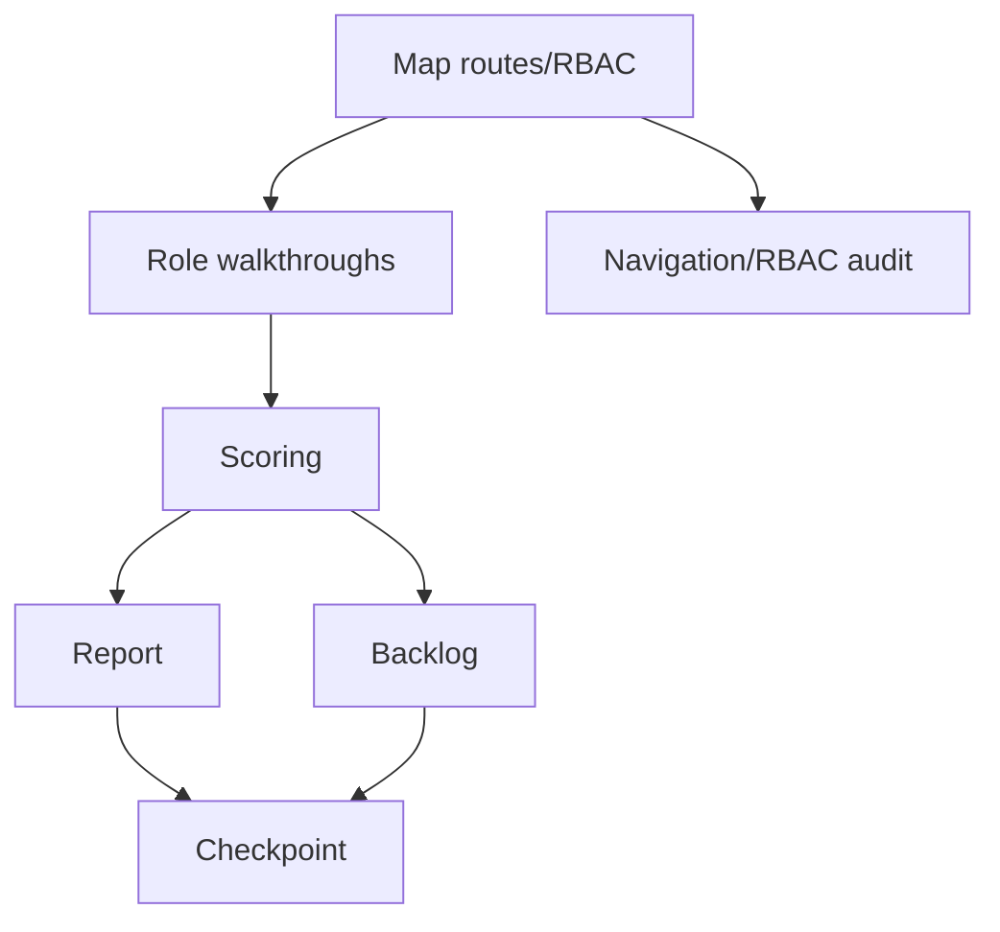

# Plan — Audit UX và giải phóng sức lao động

| ID | Phase | Task | Phụ thuộc | Output | Trạng thái |
|---|---|---|---|---|---|
| UX-01 | 1 | Lập bản đồ route/module/RBAC và điểm vào | — | `01_product_map.md` | done |
| UX-02 | 1 | Map dữ liệu phải nhập lại và flow nhạy cảm | UX-01 | Ghi trong product map/findings | done |
| UX-10 | 2 | Walkthrough lễ tân/telesale | UX-01/02 | `02_role_findings.md` | done |
| UX-11 | 2 | Walkthrough tư vấn/bác sĩ/điều dưỡng | UX-01/02 | `02_role_findings.md` | done |
| UX-12 | 2 | Walkthrough CSKH | UX-01/02 | `02_role_findings.md` | done |
| UX-13 | 2 | Walkthrough kế toán | UX-01/02 | `02_role_findings.md` | done |
| UX-14 | 2 | Walkthrough admin/nhân sự/CTV | UX-01/02 | `02_role_findings.md` | done |
| UX-15 | 2 | Walkthrough portal CTV | UX-01/03 | `02_role_findings.md` | done |
| UX-20 | 3 | Chấm điểm impact/effort/risk | UX-10..15 | `03_prioritized_backlog.md` | done |
| UX-21 | 3 | Lập automation opportunity map | UX-10..15 | `03_prioritized_backlog.md` | done |
| UX-22 | 3 | Kiểm tra navigation/RBAC friction | UX-01/10..15 | `01_product_map.md`, `02_role_findings.md` | done |
| UX-30 | 4 | Viết báo cáo audit | UX-20/22 | `AUDIT_UX_VAN_HANH_2026-08.md` | done |
| UX-31 | 4 | Tách quick wins/roadmap/acceptance criteria | UX-20/21 | `03_prioritized_backlog.md` | done |
| UX-32 | 4 | Ghi checkpoint, nguồn, quyết định, changelog | UX-30/31 | Bộ nhớ audit | in_progress |

## Phụ thuộc chính

## Definition of done

Báo cáo chính đã được viết; mọi phát hiện quan trọng có bằng chứng hoặc nhãn cần kiểm chứng; có bảng P0–P3, quick wins, automation map, 30/60/90 roadmap và tiêu chí nghiệm thu; bộ nhớ dự án có state/decisions/sources/open questions/changelog.
