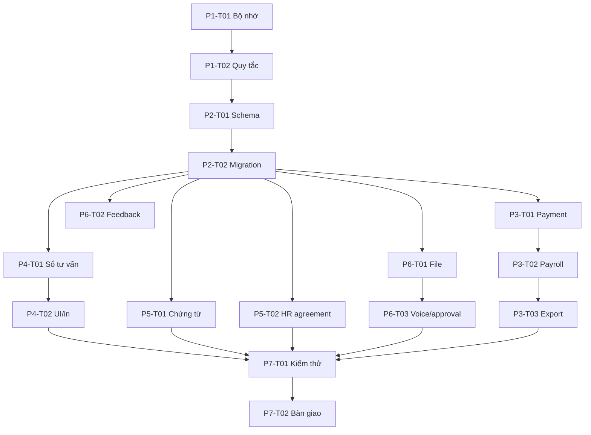
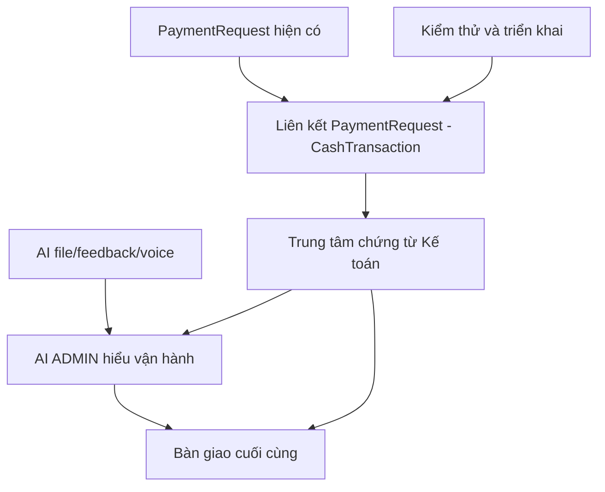

# Kế hoạch thực thi

## Phases

| ID | Phase | Status | Depends on | Exit criteria |
|---|---|---|---|---|
| P1 | Bộ nhớ và chốt yêu cầu | in_progress | — | Brief, quyết định và state được lưu |
| P2 | Schema/migration additive | in_progress | P1 | Prisma validate sạch; migration không reset |
| P3 | Lương theo thực thu | in_progress | P2 | Payment là căn cứ; không đếm đôi; test sạch |
| P4 | Sổ tư vấn 24 giờ | not_started | P2 | Auto-fill; quick screening; quá hạn chỉ ADMIN; audit |
| P5 | Chứng từ + thỏa thuận HR | not_started | P2 | Có chứng từ in/duyệt/liên kết và hồ sơ agreement |
| P6 | AI file/feedback/voice | not_started | P2,P4,P5 | Có file context, feedback, voice fallback và approval |
| P7 | Kiểm thử và triển khai | not_started | P3,P4,P5,P6 | tsc/test/build/migration/status/HTTP đạt |

## Tasks

| ID | Task | Phase | Depends on | Status | Output | Done when | Risk | Evidence |
|---|---|---|---|---|---|---|---|---|
| P1-T01 | Khởi tạo bộ nhớ dài hạn | P1 | — | done | `.task-memory` | Có brief/plan/state/decisions/sources/questions/changelog | low | init script |
| P1-T02 | Lưu quy tắc anh đã chốt | P1 | P1-T01 | done | brief + decisions | Có nguồn sự thật tiếng Việt | low | 00_brief.md |
| P2-T01 | Thêm model nghiệp vụ | P2 | P1 | done | Prisma schema | `prisma validate` đạt | medium | tsc/validate |
| P2-T02 | Tạo migration additive | P2 | P2-T01 | in_progress | migration SQL | SQL có đủ bảng/cột/index/FK, không drop/reset | high | migration.sql |
| P3-T01 | Gom Payment theo tháng | P3 | P2 | in_progress | commission-data | Có phân bổ theo role/allocation | high | tsc |
| P3-T02 | Tách auto commission và override | P3 | P3-T01 | in_progress | payroll + actions/UI | Không cộng đôi và có nhãn rõ | medium | tsc |
| P3-T03 | Cập nhật export kế toán | P3 | P3-T02 | not_started | xlsx/doc | Mẫu cuối tháng phản ánh thực thu |
| P4-T01 | ConsultationRecord/actions | P4 | P2 | not_started | schema/actions | Chỉnh sửa 24h + audit |
| P4-T02 | Consultation UI/print | P4 | P4-T01 | not_started | UI/export | In được phiếu sàng lọc/tư vấn/đăng ký |
| P5-T01 | PaymentRequest workflow | P5 | P2 | not_started | model/actions/UI/export | Chi có request trước/được duyệt |
| P5-T02 | StaffAgreement workflow | P5 | P2 | not_started | HR UI/actions/export | Lưu version/status/signed snapshot |
| P6-T01 | File upload/extraction context | P6 | P2 | not_started | AssistantFile + action | File được kiểm soát loại/kích thước |
| P6-T02 | Feedback memory | P6 | P2 | not_started | AssistantFeedback + prompt | Góp ý được lưu và dùng làm context |
| P6-T03 | Voice + safe code proposal | P6 | P6-T01 | not_started | browser voice + approval | Không tự sửa production |
| P7-T01 | Test/build/checkpoint | P7 | P3-P6 | not_started | logs in checks | Đạt tiêu chí chất lượng |
| P7-T02 | Docs/GitHub/Windows | P7 | P7-T01 | not_started | changelog + deploy | Push và cập nhật máy an toàn |

## Dependency map

## Phụ lục kế hoạch bắt buộc — cập nhật 18/08/2026

Yêu cầu mới không thay thế các phase cũ mà bổ sung hai workstream phải hoàn thành trước khi bàn giao:

| ID | Workstream | Phụ thuộc | Đầu ra bắt buộc | Trạng thái |
|---|---|---|---|---|
| W1 | AI ADMIN hiểu đầy đủ cơ chế vận hành | P6, tài liệu nghiệp vụ hiện tại | Runtime context gồm quy tắc vận hành, dữ liệu được cấp quyền, hướng dẫn module, khả năng giải thích và tra cứu; test không trả lời chung chung khi có dữ liệu | in_progress |
| W2 | Đề nghị thanh toán ↔ Sổ thu–chi ↔ Kế toán | P5, schema PaymentRequest/CashTransaction | Khoản chi nhỏ tạo được chứng từ; duyệt/chi sinh đúng một dòng CashTransaction; Thu–chi và Kế toán có liên kết ngược, trạng thái và đường dẫn chứng từ | in_progress |
| W3 | Trung tâm chứng từ kế toán | W2, bảng lương hiện tại | Xem/lọc/mở/in đề nghị thanh toán, bảng lương, phiếu thu/chi và file xuất theo tháng/trạng thái | not_started |

### Dependency bổ sung

Không được đánh dấu W1 hoặc W2 là `done` nếu chưa có bằng chứng trong `checks/` về quyền ADMIN, audit, chống ghi trùng, luồng khoản chi nhỏ, và câu trả lời AI dựa trên kiến thức vận hành + dữ liệu thật.
