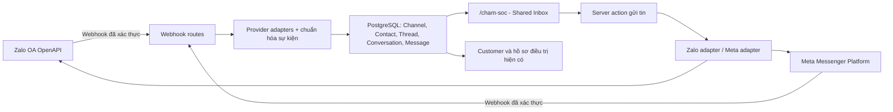

# Thiết kế Hộp thư Chăm sóc khách hàng đa kênh

**Dự án:** Trung tâm Phẫu thuật Tạo hình Thẩm mỹ — Bệnh viện Đa khoa Hồng Phúc

**Repo:** `ledinhlam23032000/ZenithTasks`

**Ngày:** 2026-08-01

**Phạm vi đầu tiên:** Zalo Official Account và Facebook Fanpage Messenger

**Trạng thái:** Thiết kế chờ chủ dự án duyệt tài liệu trước khi lập kế hoạch triển khai

## 1. Mục tiêu

Biến mục `/cham-soc` từ nhật ký nhập tay thành một hộp thư vận hành thật:

- Tin nhắn mới từ Zalo OA và Facebook Fanpage tự xuất hiện trong ZenithTasks.
- Nhân viên đọc và trả lời trực tiếp trong ZenithTasks.
- Mỗi kênh chỉ cần kết nối/ủy quyền một lần; token được làm mới tự động khi nhà cung cấp cho phép.
- Hội thoại mới vào hàng chờ, có người phụ trách rõ ràng và không bị hai nhân viên trả lời trùng.
- Một người dùng mạng xã hội được tạo thành liên hệ kênh trước; chỉ liên kết với `Customer` khi có thông tin đáng tin cậy.
- Lịch sử hội thoại, phân công, ghi chú nội bộ và lỗi gửi được lưu, tìm kiếm và kiểm toán.
- Kiến trúc có thể thêm Instagram, WhatsApp, SMS hoặc email sau này mà không đổi lõi hộp thư.

## 2. Ngoài phạm vi của đợt đầu

- Không nhập lịch sử tin nhắn cũ trước thời điểm kết nối.
- Không gửi broadcast/marketing hàng loạt.
- Không cho AI tự trả lời khách. AI hiện có chỉ được gợi ý nội dung để con người xem, sửa và bấm gửi.
- Không xây workflow builder phức tạp, tổng đài thoại hoặc hệ thống ticket độc lập.
- Không tự suy đoán một người dùng Zalo/Facebook là khách hàng nào chỉ dựa trên tên hoặc ảnh đại diện.

## 3. Cơ sở nghiên cứu và phương án chọn

Nghiên cứu Pancake, respond.io, SleekFlow, Intercom và Zendesk được lưu trong `competitor-profiles/`. Các sản phẩm tốt hội tụ ở mô hình: kết nối từng kênh riêng, chuẩn hóa thành Contact/Conversation/Message, đưa tin mới vào hàng chờ, chỉ định một người chịu trách nhiệm, có ghi chú nội bộ và cảnh báo va chạm.

Ba phương án đã xem xét:

1. **Dùng SaaS trung gian rồi đồng bộ về ZenithTasks:** ra mắt nhanh nhưng tạo hai nguồn dữ liệu khách hàng, thêm phí định kỳ và đưa hội thoại của bệnh viện qua một nhà cung cấp khác.
2. **Dùng n8n/middleware làm cầu nối:** phù hợp thử nghiệm nhưng tăng điểm lỗi vận hành, khó đảm bảo phân quyền, idempotency, trạng thái gửi và kiểm toán đồng nhất.
3. **Tích hợp chính thức trực tiếp trong ZenithTasks:** cần đầu tư ban đầu lớn hơn nhưng dữ liệu, quyền và ngữ cảnh khách hàng ở một nơi. Đây là phương án được chọn.

## 4. Kiến trúc tổng thể

Mỗi nhà cung cấp nằm sau một interface chung, dự kiến gồm `authorize`, `refreshCredentials`, `verifyWebhook`, `normalizeEvent`, `sendMessage`, `getProfile` và `healthCheck`. Mã giao diện và nghiệp vụ hộp thư không gọi trực tiếp API Zalo/Meta.

Webhook chỉ thực hiện công việc ngắn: đọc raw body, xác thực chữ ký, chống trùng, chuẩn hóa và ghi giao dịch DB rồi trả `200` nhanh. Không gọi AI hoặc thực hiện truy vấn nặng trong webhook. Meta yêu cầu phản hồi webhook trong tối đa 5 giây.

## 5. Mô hình dữ liệu

### `ChannelAccount`

Đại diện một Zalo OA hoặc Facebook Page đã kết nối.

- `provider`: `ZALO_OA | FACEBOOK_PAGE`
- `externalAccountId`, `displayName`, `avatarUrl`
- `status`: `CONNECTED | DEGRADED | REAUTH_REQUIRED | DISCONNECTED`
- access token, refresh token được mã hóa; không bao giờ trả về client hoặc ghi log
- `tokenExpiresAt`, `lastWebhookAt`, `lastHealthCheckAt`, `lastError`
- `connectedById`, `connectedAt`, `disconnectedAt`

App ID/App Secret cấp nền tảng là cấu hình máy chủ. Token ủy quyền của từng OA/Page nằm trong DB dưới dạng mã hóa bằng khóa riêng `CHANNEL_TOKEN_ENC_KEY`. Khóa và secret chỉ ở `.env`/secret volume, tuyệt đối không commit.

### `ChannelContact`

Đại diện danh tính người nhắn trên một kênh.

- Khóa duy nhất: `channelAccountId + externalUserId`
- `displayName`, `avatarUrl`, dữ liệu hồ sơ tối thiểu nhà cung cấp cho phép
- `customerId` nullable để liên kết một `Customer`
- `linkedById`, `linkedAt`, `lastSeenAt`
- trạng thái consent/withdraw khi nhà cung cấp gửi sự kiện quyền dữ liệu

Một `Customer` có thể liên kết nhiều `ChannelContact` (ví dụ một Zalo và một Facebook). Không tự ghép theo tên.

### `ChannelThread`

Luồng tin nhắn lâu dài giữa một `ChannelAccount` và một `ChannelContact`.

- Khóa duy nhất theo account và external thread/conversation ID
- `lastMessageAt`, `lastInboundAt`, `lastOutboundAt`, `unreadCount`

### `Conversation`

Một chu kỳ xử lý công việc trên thread; sau khi đóng, tin mới tiếp theo mở một chu kỳ mới.

- `status`: `OPEN | SNOOZED | CLOSED`
- `assigneeId`, `assignedAt`, `assignedById`
- `priority`, `tags`
- `openedAt`, `firstResponseAt`, `snoozedUntil`, `closedAt`
- `version` để chống ghi đè khi hai nhân viên thao tác đồng thời

### `InboxMessage`

- ID tin của nhà cung cấp dùng làm khóa chống trùng
- `direction`: `IN | OUT`
- `type`: `TEXT | IMAGE | FILE | STICKER | UNSUPPORTED`
- nội dung, thông tin attachment, tin được reply/quote
- `status`: `RECEIVED | PENDING | SENT | DELIVERED | READ | FAILED`
- `providerTimestamp`, `sentById`, mã lỗi và thông báo lỗi đã làm sạch
- `clientNonce` duy nhất để chống bấm gửi hai lần

### `ConversationEvent` và `ConversationPresence`

- Event lưu phân công, đổi trạng thái, liên kết khách, ghi chú nội bộ và retry gửi.
- Presence gửi heartbeat mỗi 5 giây khi tab đang hiển thị. Một người được coi là đang xem/đang gõ nếu heartbeat gần nhất không quá 15 giây; bản ghi cũ hơn 24 giờ được dọn hằng ngày.

### `WebhookReceipt`

Lưu provider event ID/hash, trạng thái xử lý và lỗi ngắn để đảm bảo idempotency. Payload thô đã loại token/secret chỉ giữ tối đa 7 ngày để chẩn đoán rồi tác vụ dọn dữ liệu hằng ngày xóa nội dung; ID/hash, trạng thái và lỗi đã làm sạch được giữ lâu dài cho kiểm toán.

## 6. Quan hệ với `CareMessage` hiện tại

- Không xóa và không chuyển đổi cưỡng bức dữ liệu cũ.
- `CareMessage` tiếp tục là nhật ký thủ công/di sản.
- Tin Zalo/Facebook mới chỉ lưu ở `InboxMessage`, không ghi lặp vào `CareMessage`.
- Timeline hồ sơ khách sẽ hợp nhất khi đọc: nhật ký `CareMessage` cũ + hoạt động inbox đã liên kết.
- Các thống kê chăm sóc sẽ chuyển dần sang nguồn hoạt động hợp nhất để tránh đếm trùng.

## 7. Luồng sử dụng

### Kết nối kênh

1. ADMIN mở `/cham-soc/cai-dat`.
2. Bấm `Kết nối Zalo OA` hoặc `Kết nối Facebook`.
3. Trình duyệt chuyển tới OAuth/cấp quyền chính thức của nhà cung cấp.
4. Callback kiểm tra `state`/PKCE, đổi authorization code lấy token, mã hóa và lưu.
5. Hệ thống đăng ký webhook, chạy health check và gửi/nhận tin thử.
6. Thẻ kênh hiển thị `Đã kết nối`, thời gian sự kiện cuối và nút `Kết nối lại`.

App Zalo/Meta, callback URL, quyền API và quy trình xét duyệt là bước cấu hình một lần. Sau khi các app nền tảng đã sẵn sàng, thao tác thường ngày của chủ dự án chỉ là đăng nhập và cho phép OA/Page.

### Nhận tin mới

1. Nhà cung cấp gọi webhook HTTPS.
2. Route xác thực chữ ký trên raw body. Meta dùng `X-Hub-Signature-256`; Zalo dùng `X-ZEvent-Signature` theo OA secret.
3. Event trùng bị bỏ qua an toàn.
4. Hệ thống upsert `ChannelContact` và `ChannelThread`.
5. Nếu không có Conversation đang mở, tạo Conversation `OPEN`, chưa phân công.
6. Ghi message, tăng unread và cập nhật preview.
7. Hộp thư polling mỗi 5 giây khi tab đang hiển thị; dừng khi tab ẩn và làm mới ngay khi người dùng quay lại. Không cần WebSocket ở đợt đầu.

### Nhận việc và trả lời

1. Tin mới nằm ở `Chưa phân công`.
2. Nhân viên bấm `Nhận xử lý`, hoặc lần trả lời đầu tiên tự claim bằng cập nhật nguyên tử.
3. Hệ thống tạo `InboxMessage(PENDING)` trước khi gọi API nhà cung cấp.
4. Gửi thành công cập nhật ID/status; thất bại giữ message `FAILED`, hiện lỗi thân thiện và cho retry.
5. Khi nhà cung cấp báo delivered/read, webhook cập nhật trạng thái tương ứng.

### Liên kết khách hàng

1. Contact chưa liên kết hiển thị `Khách chưa xác định`.
2. Nhân viên hỏi số điện thoại hoặc thông tin xác minh phù hợp.
3. Bấm `Liên kết khách hàng`, tìm bằng tên/mã/5 số cuối theo quyền hiện có.
4. Chọn hồ sơ có sẵn hoặc đi qua luồng tạo khách mới.
5. Hệ thống ghi audit; các lần sau tự hiện đúng hồ sơ.

## 8. Giao diện

Desktop dùng ba cột:

1. **Thanh lọc:** Chưa phân công, Của tôi, Tất cả; lọc Zalo/Facebook, trạng thái, thẻ, quá hạn.
2. **Danh sách hội thoại:** tên contact, icon kênh, preview, thời gian chờ, unread, người phụ trách.
3. **Khung làm việc:** thread tin nhắn ở giữa và panel ngữ cảnh khách bên phải (hồ sơ, lịch hẹn, dịch vụ, công nợ, liên kết khách).

Mobile chuyển thành điều hướng từng màn: danh sách → hội thoại → panel khách. Composer hỗ trợ văn bản, ảnh và tệp theo giới hạn thấp nhất của từng kênh; loại không hỗ trợ phải bị chặn trước khi gửi.

Ghi chú nội bộ có màu và nhãn riêng, không bao giờ được truyền sang nhà cung cấp. Khi người khác đang xem/gõ, header hiển thị avatar/tên; nếu dữ liệu đã thay đổi, giao diện yêu cầu tải lại trước khi ghi đè phân công/trạng thái.

Hệ thống ghi `firstResponseAt` và thời gian chờ ngay từ đợt đầu. Cảnh báo quá hạn mặc định tắt; ADMIN có thể đặt ngưỡng theo phút, áp dụng liên tục 24/7 cho tới khi có cấu hình giờ làm việc ở đợt sau.

## 9. Phân quyền và bảo mật

Các quyền mới:

- `inbox.view`: xem inbox được phân công
- `inbox.viewAll`: xem toàn bộ hội thoại
- `inbox.reply`: gửi tin
- `inbox.assign`: phân công người khác
- `inbox.linkCustomer`: liên kết contact với khách
- `inbox.manageChannels`: kết nối/ngắt kênh, chỉ ADMIN mặc định

ADMIN/MANAGER/CARE được vào mặc định; các vai trò khác phải được cấp rõ ràng. SHAREHOLDER không được xem nội dung hội thoại hoặc gửi tin vì khách có thể trao đổi thông tin sức khỏe nhạy cảm.

Yêu cầu bảo mật:

- OAuth `state` dùng một lần, Zalo PKCE verifier dùng một lần, callback có TTL.
- So sánh chữ ký bằng constant-time; raw body không bị biến đổi trước khi kiểm tra.
- Token/refresh token mã hóa AES-256-GCM bằng khóa riêng và bị che trong UI/log/audit.
- Attachment hội thoại tải về kho bảo vệ, không dùng route `/media` công khai hiện tại; route đọc tệp bắt buộc session và quyền inbox/customer phù hợp.
- Tên tệp, MIME và kích thước phải xác minh; không tin metadata từ nhà cung cấp.
- Audit kết nối, ngắt, liên kết khách, phân công, gửi, retry và xóa/anonymize.
- Sự kiện rút quyền dữ liệu của người dùng được xử lý theo chính sách bệnh viện: ngắt định danh nền tảng và xóa/anonymize dữ liệu không còn căn cứ lưu, giữ audit tối thiểu khi pháp luật cho phép.

## 10. Token, giới hạn kênh và sức khỏe kết nối

- Zalo access token hiện có hiệu lực ngắn và refresh token xoay vòng một lần; việc refresh phải chạy dưới khóa DB để hai request không dùng cùng refresh token.
- Mỗi API call Zalo lấy token hợp lệ qua một hàm duy nhất; refresh sớm trước hết hạn. Một endpoint bảo trì nội bộ có secret riêng được Windows Task Scheduler gọi mỗi 12 giờ để kiểm tra sức khỏe và refresh khi cần; API call vẫn lazy-refresh để hệ thống không phụ thuộc hoàn toàn vào lịch chạy. Nếu tác vụ bảo trì quá 24 giờ không chạy, ADMIN thấy cảnh báo rõ ràng.
- Facebook permission có thể cũ sau khi đổi mật khẩu/quyền Page. Trang cài đặt phải có `Làm mới quyền`/`Kết nối lại` và hướng dẫn Primary Receiver khi Page dùng nhiều app nhắn tin.
- Composer hiển thị cửa sổ/quyền gửi của từng kênh; khi ngoài cửa sổ cho phép thì khóa gửi tự do và giải thích phương án template phù hợp, không cố gửi rồi báo lỗi chung chung.
- Mỗi ChannelAccount có health badge; dashboard quản trị cảnh báo nếu quá lâu không có webhook, token sắp hết hạn hoặc send test thất bại.

## 11. Khả năng chịu lỗi

- Unique constraint chống webhook và message trùng.
- Claim hội thoại dùng cập nhật có điều kiện để chỉ một người thắng.
- Gửi dùng `clientNonce`; retry không tạo hai tin nội bộ.
- Lỗi nhà cung cấp được ánh xạ sang thông báo dễ hiểu và mã kỹ thuật phục vụ log.
- Khi một kênh lỗi, kênh còn lại và phần quản trị phòng khám vẫn hoạt động.
- Không xóa message thất bại; giữ để kiểm tra và retry có kiểm soát.
- Nếu lấy profile contact lỗi, tin vẫn được nhận dưới tên tạm và bổ sung profile sau.

## 12. Kiểm thử và tiêu chí nghiệm thu

### Tự động

- Unit test chữ ký Meta/Zalo, OAuth state/PKCE, mã hóa token và refresh rotation.
- Unit test normalize từng loại event, idempotency, claim cạnh tranh, permission và trạng thái message.
- Integration test webhook trùng, sai chữ ký, sai thứ tự delivered/read, provider timeout và token hết hạn.
- Test migration giữ nguyên toàn bộ `CareMessage` hiện có.
- UI test ba hàng chờ, gửi/retry, ghi chú nội bộ, liên kết khách và mobile.
- `tsc`, Vitest, ESLint và production build phải qua.

### Thử thật có kiểm soát

- Kết nối OA/Page thử, gửi một tin từ tài khoản khách thử vào từng kênh.
- Xác nhận ZenithTasks nhận đúng một bản, trả lời tới đúng kênh và trạng thái cập nhật.
- Hai tài khoản nhân viên cùng mở một hội thoại để kiểm tra claim/collision.
- Thu hồi/đổi permission để kiểm tra health badge và reconnect.
- Không dùng dữ liệu bệnh nhân thật trong giai đoạn thử.

### Hoàn thành khi

- Tin mới của cả hai kênh xuất hiện ổn định và trả lời trực tiếp được.
- Không có tin trùng khi webhook retry.
- Không lộ token trong source, log, HTML hoặc audit.
- Nhân viên không có quyền không thể xem/gửi bằng gọi route trực tiếp.
- Customer linking có audit và không làm thay đổi mã hóa số điện thoại.
- Tài liệu `README.md`, `PROJECT-OVERVIEW.md`, `web/BAN-GIAO.md`, `web/DU-AN.md`, `.env.example` và hướng dẫn Windows được cập nhật khi triển khai xong.

## 13. Triển khai và quay lui

- Migration chỉ thêm bảng/enum/index mới, không xóa `CareMessage`.
- Tính năng nằm sau cờ `OMNICHANNEL_ENABLED`, mặc định `false`. Khi tắt, `/cham-soc` tiếp tục dùng nhật ký `CareMessage` hiện tại. Khi bật nhưng chưa có kênh, `/cham-soc` hiển thị thẻ onboarding kết nối kênh và vẫn có tab `Nhật ký thủ công` để truy cập `CareMessage` cũ.
- Triển khai schema trước, sau đó app; nếu connector lỗi có thể ngắt ChannelAccount mà không ảnh hưởng module khác.
- Sao lưu PostgreSQL và kho attachment trước lần bật production.
- Có smoke test sau mỗi `Sua-Loi.bat`: app health, login, module cũ, webhook verify và send/receive test.

Các cổng ngoài cần hoàn tất trước khi bật production:

- Meta App có URL chính sách riêng tư/xóa dữ liệu, webhook HTTPS công khai, quyền Page cần thiết và Advanced Access/App Review cho người dùng thật; ADMIN Page thực hiện OAuth chọn đúng Fanpage.
- Zalo App được liên kết với OA, callback/webhook HTTPS công khai và các quyền OA cần thiết được duyệt; ADMIN OA thực hiện OAuth/PKCE chọn đúng OA.
- Cloudflare Tunnel/DNS đưa callback tới app ổn định. Chưa xác nhận đủ quyền, webhook và gửi/nhận thử thì kênh chỉ ở trạng thái `DEGRADED`, không được báo là production-ready.

## 14. Quyết định đã chốt

- Chỉ nhận tin mới sau khi kết nối.
- Trả lời trực tiếp trong ZenithTasks.
- Zalo OA và Facebook Fanpage là hai kênh đầu tiên.
- Tích hợp trực tiếp bằng API chính thức, không dùng SaaS/n8n làm nguồn vận hành chính.
- Contact kênh được tạo trước và liên kết Customer sau khi xác minh.
- Chưa bật AI tự trả lời hoặc broadcast trong đợt đầu.
